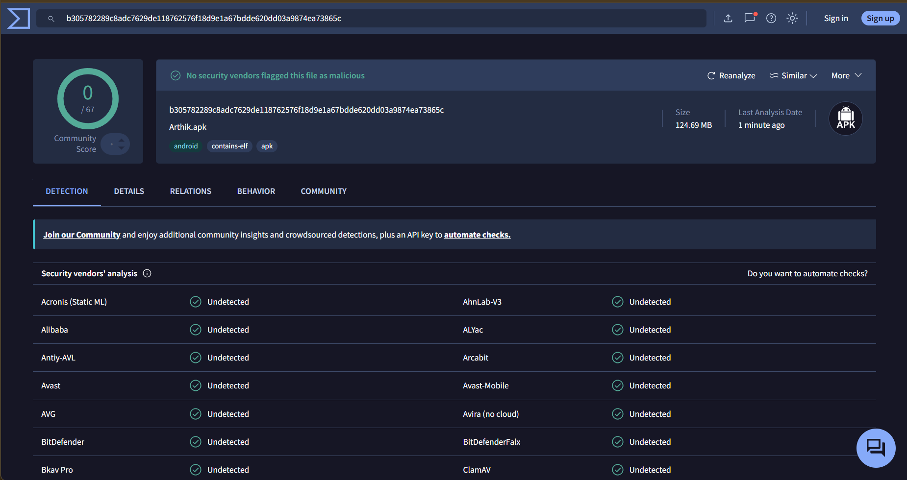

# Arthik

> A premium, offline-first personal expense and savings tracker for India — built with React Native, Expo & Supabase.
> **New in 2.0:** ⚡ Automatic Logging (Beta) — bank SMS and UPI payments become transactions automatically, processed on your phone.

[](https://reactnative.dev/)
[](https://expo.dev/)
[](https://www.typescriptlang.org/)
[](https://supabase.com/)
[](https://github.com/Kislaya-06/Arthik-App/releases/latest)
[](https://www.virustotal.com/gui/file/b305782289c8adc7629de118762576f18d9e1a67bdde620dd03a9874ea73865c)
[](./tests)
[](https://opensource.org/licenses/MIT)

---

## 🛡️ Security & Safety Verified (0/67 Clean)

Arthik is **100% safe, ad-free, tracker-free, and open-source**. Every release APK binary is independently verified across 65+ top antivirus and security engines on **VirusTotal**.

<p align="center">
  
</p>

> **🔒 Privacy-First Guarantee**: All bank SMS parsing and UPI notification detection run **strictly on your device**. Personal SMS, OTPs, balance queries, and personal chats are completely filtered out. No SMS text, notification data, or raw financial messages ever leave your phone.

---

## 📲 Download & Install

Arthik is distributed as an Android APK on GitHub — no Play Store needed.

**[⬇️ Download Arthik v2.1.0 APK](https://github.com/Kislaya-06/Arthik-App/releases/download/v2.1.0/Arthik-v2.1.0.apk)** *(or get it from [Latest Releases](https://github.com/Kislaya-06/Arthik-App/releases/latest))*

1. Tap the link above on your Android phone (or open [GitHub Releases](https://github.com/Kislaya-06/Arthik-App/releases/latest) → **Assets** → `Arthik-v2.1.0.apk`).
2. If the browser warns *"This type of file can harm your device"*, tap **Download anyway**.
3. Open the downloaded file → allow **Install unknown apps** for your browser if asked → **Install**.
4. Open **Arthik** and sign in with Google or Email.

> 💡 Android 8.0 (Oreo) or newer. Package: `com.kislaya_agarwal.arthik`.

### Updating
You don't need to come back here. When a new version is required, Arthik shows an update screen: tap **Download & install**, the update downloads inside the app, and Android asks you to confirm the install. Small fixes arrive silently over-the-air.

> Coming from **v1.x**? The update screen will open the download in your browser. When it finishes, tap the download notification and choose **Update**. Your data stays in your account.

---

## ✨ Features

### ⚡ Automatic Logging — *Beta* (Android, v2.0)
Log expenses and income without typing them.
- **Bank SMS + payment-app notifications** (Google Pay, PhonePe, Paytm, Navi, BHIM, CRED, Amazon Pay, MobiKwik, super.money) become transactions automatically.
- **Processed on your phone.** SMS text is never uploaded. Personal SMS and OTPs are filtered out before anything else runs. Detection data lives in an encrypted on-device database.
- **You choose the accounts.** Arthik finds your bank accounts (last 4 digits); only the ones you select are tracked.
- **Never guesses.** Unclear payments (money from a person, an unreadable message, a payment that looks like one you already added) wait in **Pending Review**.
- **One payment = one entry.** A PhonePe notification and the bank SMS for the same payment are matched into one transaction; two genuine ₹20 payments stay two.
- **Discovery, not backfill.** Old messages are used only to learn your banks and formats — they are never added to your history.
- **Transparent.** Every automatic transaction shows its sources and *"Why was this logged?"*, with **Report a problem**.
- **Learns from you.** "Remember Zomato → Food", "Ignore similar messages" (exact format only, never "every ₹20").
- **Bank emails too (v2.1, optional).** For banks and cards that email instead of sending an SMS: alert emails from Gmail, Outlook and other email apps are read from their notifications, on your phone. SMS, app notification and email for the same payment become **one** transaction — even when the email arrives hours later. Unclear matches wait in review.
- **Welcome back.** After signing out or pausing, choose to *recover* the missed period or only *learn* from it.

> Beta is rolling out gradually, starting with people who used Arthik before v2.0. It is controlled server-side (no app update needed to widen it).

### Core
- 🧾 **Expense & income tracking** — custom spring keypad (with calculator), Cash / UPI / Card, categories, notes with suggestions.
- 🎯 **Budget Modes: Daily, Weekly, Monthly** — or **Pure Mode** with no limits (Inflow vs Outflow rings).
- 🐷 **Gullak** — unspent budget rolls into your savings jar at the end of every period; add manual deposits too.
- 🔥 **Streaks & calendar** — scaled to your cadence; paused periods never break a streak.
- 🔄 **Next-day cadence switching** with carry-forward (Additive / Allocation) and capacity warnings.
- 🛡️ **Vault Spending Guard** — real-money discipline: no expenses when your available money is ₹0.
- 📈 **Insights** — weekly, monthly and yearly breakdowns, cash-flow and savings charts.
- 📶 **Offline-first** — everything works offline; changes sync automatically with retries and a failed-sync recovery list.
- 🔔 **Smart notifications** — max one nudge a day, budget alerts, rollover summaries.
- 🎨 **Light, Dark & AMOLED** themes with ambient backgrounds.
- 🔒 **Biometric app lock**, Google / Email sign-in, full account deletion.
- ⬆️ **In-app updates** — mandatory updates download inside the app and open Android's installer; OTA for small fixes.

---

## 🛠 Tech Stack

| Layer | Technology |
|---|---|
| Framework | React Native 0.86 + Expo SDK 57 (`expo-dev-client`) |
| Language | TypeScript (`strict`) |
| State | Zustand (`persist` + AsyncStorage offline queues) |
| Backend & Auth | Supabase (PostgreSQL, Auth, Row Level Security, Edge Functions) |
| Navigation | React Navigation (Native Stack + custom floating tabs) |
| On-device storage | AsyncStorage, `expo-sqlite` with **SQLCipher** (Automatic Logging), `expo-secure-store` |
| Native (Android) | Local Expo module `modules/arthik-autolog` (Kotlin): SMS receiver, notification listener, headless task |
| Background | `expo-task-manager`, `expo-background-task` |
| Updates | EAS Build (APK), EAS Update (OTA), in-app APK updater (`expo-file-system`, `expo-intent-launcher`) |
| UI | `lucide-react-native`, Quicksand, `react-native-svg`, Reanimated, Gesture Handler |
| Dates | `date-fns`, Indian number formatting (₹) |
| Tests | Vitest (66 files, 1103 tests) |

---

## 📁 Project Structure

```text
modules/
└── arthik-autolog/      # Kotlin: SMS + notification capture, privacy filter, queue, headless service
src/
├── components/          # UI primitives (ui/), feature components, autolog/
├── config/              # Supabase client, theme tokens
├── features/autoLog/    # Automatic Logging: parser, engine, encrypted DB, lifecycle, rollout
├── hooks/               # useExpenseForm, useSavingsDashboard, useScrollDirection, …
├── lib/                 # Pure domain logic (budget periods, Gullak, insights, version check, apkInstaller)
├── navigation/          # Root stack, tabs, navigationRef
├── screens/             # Home, History, Savings, Insights, Profile, … and autolog/
├── store/               # Zustand stores
└── types/               # Routes and domain types
supabase/
├── migrations/          # SQL migrations
└── functions/           # delete-user-account edge function
tests/                   # Vitest
docs/                    # Architecture, ADRs, Automatic Logging, release process
```

---

## 📚 Documentation

- [`AGENTS.md`](./AGENTS.md) — coding standards, design tokens, safety invariants (for humans and AI agents).
- [`CONTEXT.md`](./CONTEXT.md) — domain model and business rules.
- [`docs/architecture.md`](./docs/architecture.md) — layers, stores, offline write path, startup, Gullak engine.
- [`docs/AUTO_LOGGING.md`](./docs/AUTO_LOGGING.md) — Automatic Logging architecture and rules.
- [`docs/RELEASE_PROCESS.md`](./docs/RELEASE_PROCESS.md) — how to ship an APK, force-update users, and control the Beta rollout.
- [`docs/PLAY_STORE_AUTOLOG.md`](./docs/PLAY_STORE_AUTOLOG.md) — what changes for a future Play Store release.
- [`docs/prd.md`](./docs/prd.md) · [`docs/adr/`](./docs/adr/) — product requirements and architecture decisions.

---

## 🧑‍💻 Developer Setup

### Prerequisites
- Node.js **22+** (tests use Node's built-in SQLite)
- Android Studio + SDK (emulator) and/or an Android phone with USB debugging
- A Supabase project
- `npm install -g eas-cli`

> ⚠️ **Expo Go is not supported.** Arthik has custom native code. Use a development build.

### Quickstart
```bash
git clone https://github.com/Kislaya-06/Arthik-App.git
cd Arthik-App
npm install
```

Create `.env` (optional — `app.json` has defaults):
```env
EXPO_PUBLIC_SUPABASE_URL=your_supabase_project_url
EXPO_PUBLIC_SUPABASE_ANON_KEY=your_supabase_anon_key
```

Database: run [`schema.sql`](./schema.sql) in the Supabase SQL Editor (or the files in `supabase/migrations/` in order).

Development build (once, and whenever native code changes):
```bash
eas build -p android --profile development
```
Install it, then start Metro:
```bash
npm run dev          # one device: adb reverse + expo start
```
Phone **and** emulator together: see `DEV_SETUP_PHONE_AND_EMULATOR.md` (runs `adb reverse tcp:8081` per device).

Checks:
```bash
npm run typecheck
npm test
```

---

## 🗄 Database

All tables use Row Level Security scoped to `auth.uid()`.

| Table | Purpose |
|---|---|
| `profiles` | Name, budget settings, registration time |
| `categories` | Default + custom categories |
| `expenses` | Transactions (amount, type, category, payment mode, date, note) |
| `daily_savings_log` | Finalized daily records |
| `budget_plan_changes` | Cadence / budget timeline |
| `budget_periods` | Finalized weekly / monthly periods |
| `gullak_deposits` | Manual savings deposits |
| `autolog_profiles` | Automatic Logging on/off, timestamps, tracked accounts as bank + last 4 digits. **No SMS content.** |
| `app_config` | `version_control` (force update) and `feature_flags` (Beta rollout) — public read |

---

## 🚀 Releasing

Full checklist: [`docs/RELEASE_PROCESS.md`](./docs/RELEASE_PROCESS.md).

```bash
eas build -p android --profile preview                       # release APK (versionCode auto-increments)
eas update --branch preview --message "Fix: …"               # OTA for JS-only fixes (same app version)
```
Force-update everyone: update the `version_control` row in `app_config` (min version + direct APK link).
Widen the Automatic Logging Beta: set `feature_flags.autolog.audience` to `all`.

---

## 📄 License
[MIT](./LICENSE)

## 👤 Author
**Kislaya Agarwal** — [@Kislaya-06](https://github.com/Kislaya-06)
