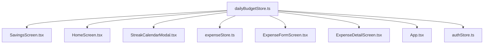

# Technical Architecture Map: `src/store/dailyBudgetStore.ts`

This document provides a comprehensive, read-only architectural analysis of `src/store/dailyBudgetStore.ts` (1,142 lines). It adheres strictly to the domain vocabulary defined in [CONTEXT.md](file:///d:/Arthik-App/CONTEXT.md) and cites exact lines and verified code.

---

## 1. Inventory of Functions

Every internal and exported function in `src/store/dailyBudgetStore.ts` is catalogued below.

| # | Name | Line(s) | Category | Description |
|---|------|---------|----------|-------------|
| 1 | `registerExpenseGetter` | 9–11 | **STATE-MUTATING** | Registers an external getter callback from `expenseStore` to populate the module-scoped `expenseGetter` variable. |
| 2 | `getCurrentExpenses` | 12–14 | **CROSS-STORE** | Invokes the registered `expenseGetter` callback to retrieve current expenses from `useExpenseStore`. |
| 3 | `getIncomeCategoryIds` | 21–31 | **CROSS-STORE** | Reads `useCategoryStore.getState().categories` and filters category names against `DEFAULT_INCOME_KEYWORDS` to return a `Set<string>` of income category IDs. |
| 4 | `calculateSavingsMetrics` | 43–157 | **MIXED** | Pure mathematical aggregation of savings, penalties, and streaks from `DailyRecord` entries, but reads `useAuthStore.getState()` as a fallback when `userCreatedAtStr` is omitted, and queries `new Date()` directly. |
| 5 | `getPendingSettingsKey` | 159–160 | **PURE** | Formats and returns the per-user AsyncStorage key string (`@arthik_pending_settings_${userId}`). |
| 6 | `savePendingSettingsOffline` | 161–174 | **STORAGE** | Reads, merges, and writes pending profile budget updates (`daily_budget`, `is_auto_renew`) to AsyncStorage. |
| 7 | `clearPendingSettingsOffline` | 176–198 | **STORAGE** | Removes or clears specific keys from the offline pending settings entry in AsyncStorage. |
| 8 | `getTodayDateStr` | 229 | **SYSTEM-TIME** | Reads device clock via `new Date()` and formats as `'yyyy-MM-dd'`. |
| 9 | `getTodayRecord` | 246–262 | **STORE-READ** | Retrieves today's `DailyRecord` from store state or synthesizes an unfinalized active record if none exists. |
| 10 | `getPastRecordsList` | 264–270 | **STORE-READ** | Filters all stored `dailyRecords` for dates `< todayStr` and sorts them in descending chronological order. |
| 11 | `setDailyBudget` | 272–326 | **MIXED** | Updates profile recurring allowance and today's record in store, recalculates metrics, queues offline patch in AsyncStorage, and syncs update to Supabase `profiles`. |
| 12 | `toggleAutoRenew` | 328–377 | **MIXED** | Updates `isAutoRenew` in store, ensures today's budget is populated if turning ON, recalculates metrics, queues offline patch, and syncs update to Supabase `profiles`. |
| 13 | `setTodayBudget` | 379–399 | **CROSS-STORE** | Overrides today's record budget without changing profile baseline, and recalculates metrics (which touches `useAuthStore`). |
| 14 | `addToTodayBudget` | 401–424 | **CROSS-STORE** | Increments today's record budget by an additional top-up amount, and recalculates metrics (which touches `useAuthStore`). |
| 15 | `syncWithExpenses` | 426–532 | **MIXED** | Calculates live spent for today, updates store state, checks 80%/100% threshold notifications (`notificationStore` + native module), and triggers `checkAndRollover`. |
| 16 | `checkAndRollover` | 534–749 | **MIXED** | Evaluates and finalizes past days, calculates spent/saved/status, upserts to Supabase `daily_savings_log`, fires rollover notification (`notificationStore` + native module), and recalculates metrics. |
| 17 | `uploadPendingDailyRecords` | 751–801 | **MIXED** | Scans `dailyRecords` for `needsUpload === true`, upserts them to Supabase `daily_savings_log`, and clears `needsUpload`. |
| 18 | `hydrateFromSupabase` | 803–1113 | **MIXED** | Orchestrates full startup hydration: waits for AsyncStorage persist rehydration, resets state if user switched, sets notification owner, reads pending offline settings, fetches Supabase `profiles` and `daily_savings_log`, executes self-healing logic for corrupted 500-budget records, recalculates metrics, triggers `checkAndRollover`, and flushes pending uploads. |
| 19 | `resetDailyBudget` | 1115–1130 | **STORAGE** | Resets all Zustand store attributes to defaults and wipes `'arthik-daily-budget-storage-v2'` from AsyncStorage. |
| 20 | Store Reset Callback Subscription | 1139–1141 | **CROSS-STORE** | Subscribes `resetDailyBudget` to `authStore` via `registerStoreResetCallback`. |

> [!WARNING]
> **The MIXED Functions**:
> Functions **#4, #11, #12, #15, #16, #17, #18** combine local state mutation, cross-store reads/notifications, and asynchronous storage/Supabase I/O. These 7 functions comprise ~85% of the file's line count and represent the highest blast radius.

---

## 2. The Rules, Stated Exactly

All rules below were extracted directly from the source code.

### 2.1 How a Day's Budget is Decided

A day's budget is derived according to three distinct tiers:

1. **Recurring Allowance (Base Daily Budget)**:
   - Configured via `setDailyBudget(amount)` (lines 272–326).
   - Sanitized via `cleanAmount = Math.max(0, Math.round(amount))` (line 273).
   - If `cleanAmount > 0`, `isAutoRenew` is forced to `true` (`willAutoRenew = cleanAmount > 0 ? true : get().isAutoRenew`, line 276).
   - Applies automatically to any new day when `isAutoRenew` is `true`.
2. **Per-Day Override (Day's Allowance)**:
   - Configured via `setTodayBudget(amount)` (lines 379–399).
   - Sanitized via `cleanAmount = Math.max(0, Math.round(amount))` (line 380).
   - Modifies `records[todayStr].budget` directly (line 392); leaves profile `dailyBudgetAmount` and `isAutoRenew` untouched.
3. **Top-Up (`addToTodayBudget`)**:
   - Configured via `addToTodayBudget(extraAmount)` (lines 401–424).
   - Sanitized via `cleanExtra = Math.max(0, Math.round(extraAmount))` (line 402). If `cleanExtra <= 0`, it is a no-op (line 403).
   - If no record exists for today, initializes base budget to `isAutoRenew ? dailyBudgetAmount : 0` (line 409).
   - Sets `newBudget = currentToday.budget + cleanExtra` (line 416).
4. **Day Where the User Set Nothing (Unset / Fresh Day)**:
   - In `getTodayRecord()` (lines 253–254): If no record exists in `dailyRecords`, budget is `get().isAutoRenew ? get().dailyBudgetAmount : 0`. If `isAutoRenew` is `false`, budget is strictly `0`.
   - In `syncWithExpenses()` (line 446): If `!todayRecord`, budget is `get().isAutoRenew && get().dailyBudgetAmount > 0 ? get().dailyBudgetAmount : 0`.
   - In `hydrateFromSupabase()` (lines 1077, 1086–1089): If `!records[todayStr]`, budget is `resolvedAutoRenew && resolvedBudget > 0 ? resolvedBudget : 0`. If a record exists but has `budget === 0` while `isFinalized === false` and `resolvedAutoRenew === true`, it is updated to `resolvedBudget`.
   - In `checkAndRollover()` for historical days without records (lines 613–626):
     ```ts
     615: if (get().isAutoRenew && get().dailyBudgetAmount > 0) {
     616:   budget = get().dailyBudgetAmount;
     617:   saved = Math.max(0, budget - spent);
     618:   status = spent > budget ? 'exceeded' : saved > 0 ? 'saved' : 'even';
     619: } else if (spent > 0) {
     620:   status = 'unknown';
     621:   budget = 0;
     622:   saved = 0;
     623: } else {
     624:   // No prior record, 0 budget, 0 spent: skip
     625:   continue;
     626: }
     ```
   - In `checkAndRollover()` for historical days with existing record having `budget === 0` (lines 628–638): If `isAutoRenew && dailyBudgetAmount > 0`, retroactively assigns `budget = dailyBudgetAmount`; otherwise, locks `status = 'unknown'`, `budget = 0`, `saved = 0`.

### 2.2 How "Spent" is Computed and Excluded Transactions

The computation of spent occurs identically in `syncWithExpenses` (lines 432–440), `checkAndRollover` (lines 547–555), and `hydrateFromSupabase` (lines 890–898):

```ts
432: let todaySpent = 0;
433: for (let i = 0; i < expenses.length; i++) {
434:   const e = expenses[i];
435:   const isIncome = e.type === 'income' || (e.type !== 'expense' && e.category_id ? incomeIds.has(e.category_id) : false);
436:   const cleanDate = e.expense_date?.split('T')[0]?.trim();
437:   if (cleanDate === todayStr && !isIncome) {
438:     todaySpent += Number(e.amount) || 0;
439:   }
440: }
```

**Excluded Transactions**:
1. **Income Transactions**: Excluded if `e.type === 'income'`, OR if `e.type !== 'expense'` AND `e.category_id` exists in `incomeIds` (from `getIncomeCategoryIds()`).
2. **Date Mismatches**: Excluded if `cleanDate !== targetDate`.
3. **Pre-Registration Transactions**:
   - In `calculateSavingsMetrics` (lines 51–53): `if (userCreatedAt && r.date < userCreatedAt) return;`
   - In `checkAndRollover` (lines 581–589): Any record where `d < userCreatedAtStr` is purged from state via `delete records[d]` and skipped.
   - In `hydrateFromSupabase` (lines 909, 961): Any log entry where `d < userCreatedAtStr` is ignored.
4. **Invalid Amounts**: Transactions with `NaN` or non-numeric amounts resolve to `0` via `Number(e.amount) || 0`.

### 2.3 How "Saved" is Computed

- **For Active / Today Records**:
  - Formula: `saved = Math.max(0, budget - spent)` (lines 289, 340, 393, 418, 451, 457).
  - Unspent allowance is calculated in real time. If `spent >= budget`, `saved` is `0`.
- **For Finalized Past Days**:
  - In `checkAndRollover` (lines 610, 617, 631): `saved = Math.max(0, budget - spent)`.
  - If `status === 'unknown'` (lines 602, 622, 636): `saved = 0`.
  - In `hydrateFromSupabase` (lines 1013–1019):
    - If `dayBudget <= 0`: `daySaved = 0`.
    - If `dayBudget > 0`: `daySaved = Math.max(0, dayBudget - daySpent)`.

### 2.4 When a Day Becomes Finalized and What Triggers It

- **Definition of Finalized**: `DailyRecord.isFinalized === true`. The day's metrics are permanently frozen and queued for remote sync to `daily_savings_log` (`needsUpload: true`).
- **Condition for Finalization**: A day is finalized **only if it is strictly in the past** (`d < todayStr`). Today is **never** finalized (`isFinalized: false`, lines 259, 284, 341, 388, 412, 452, 1083).
- **Execution Triggers**:
  1. **At the end of `syncWithExpenses(expenses)`** (line 531): Called whenever an expense is added, edited, deleted, or refreshed.
  2. **In `hydrateFromSupabase(userId)`** (line 1106): Called upon user authentication or refresh.
- **Roll-over Workflow (`checkAndRollover`)**:
  - Scans all past dates (`pastDates = new Set(...)`, lines 558–570) derived from existing `dailyRecords` keys `< todayStr` unioned with all expense dates `< todayStr`.
  - For each date `d >= userCreatedAtStr`, if any metric changed or `!existing.isFinalized`, sets `isFinalized: true`, `needsUpload: true`, and triggers an asynchronous upsert to Supabase `daily_savings_log` (lines 650–686).

### 2.5 How Each Status is Chosen

1. **Active (`status: 'active'`)**:
   - Chosen exclusively for **today** when `todaySpent <= budget || budget === 0` (lines 260, 285, 290, 342, 389, 394, 413, 420, 453, 461, 1084).
   - If `budget === 0`, today remains `'active'` even if `todaySpent > 0` (line 453).
2. **Exceeded (`status: 'exceeded'`)**:
   - For today: when `todaySpent > budget && budget > 0` (lines 290, 342, 394, 420, 453, 460).
   - For past days: in `checkAndRollover` (lines 611, 618, 632) and `hydrateFromSupabase` (line 1018), when `spent > budget && budget > 0`.
3. **Saved (`status: 'saved'`)**:
   - For finalized past days where `budget > 0`, `spent <= budget`, and `saved > 0` (lines 611, 618, 632, 1018).
4. **Even (`status: 'even'`)**:
   - For finalized past days where `budget > 0`, `spent === budget`, and `saved === 0` (lines 611, 618, 632).
   - In `hydrateFromSupabase` (line 1015): assigned if `dayBudget <= 0 && daySpent === 0`.
5. **Unknown (`status: 'unknown'`)**:
   - Past days where no budget was allocated (`budget === 0`) and `spent > 0` (lines 620, 634, 1015).
   - Preserved past days previously marked `'unknown'` (line 598).

> [!IMPORTANT]
> **Discrepancy with CONTEXT.md & Database Schema**:
> - **Code vs `schema.sql`**: `schema.sql` line 186 enforces check constraint `CHECK (status IN ('saved', 'missed', 'even', 'unknown'))`. In `dailyBudgetStore.ts`, the TypeScript interface uses `'exceeded'` (line 39). When sending to Supabase, lines 663–670 and 763–770 translate `'exceeded'` into `'missed'`.
> - **Code vs CONTEXT.md on `status: 'even'`**: CONTEXT.md Section 2 states that an untracked day with `budget === 0` is `'unknown'`. However, `hydrateFromSupabase` line 1015 sets `evaluatedStatus = daySpent > 0 ? 'unknown' : 'even'`. Consequently, a zero-budget zero-spend day loaded from Supabase is assigned `'even'`. As traced in Section 2.6, **any day with `status === 'even'` breaks the savings streak**.

### 2.6 How the Streak is Computed

The savings streak is computed by `calculateSavingsMetrics` (lines 80–102):

```ts
80:  let streak = 0;
81:  let dayCheck = subDays(new Date(), 1);
82:  while (true) {
83:    const dStr = format(dayCheck, 'yyyy-MM-dd');
84:    if (userCreatedAt && dStr < userCreatedAt) {
85:      break;
86:    }
87:    const rec = records[dStr];
88:    if (rec && rec.isFinalized) {
89:      // 'unknown' days neither extend nor break the streak: skip and continue checking earlier days
90:      if (rec.status === 'unknown') {
91:        dayCheck = subDays(dayCheck, 1);
92:        continue;
93:      }
94:      if (rec.status === 'saved' && (rec.saved || 0) > 0) {
95:        streak++;
96:        dayCheck = subDays(dayCheck, 1);
97:        continue;
98:      }
99:    }
100:   // Any other status (exceeded, even, active, or missing unfinalized day) breaks the streak
101:   break;
102: }
```

- **What Extends the Streak**: Only a finalized past day with `rec.status === 'saved'` and `rec.saved > 0` (lines 94–98).
- **What Breaks the Streak**:
  - `status === 'exceeded'`
  - `status === 'even'`
  - `status === 'active'` (an unfinalized past record)
  - Missing day in `records` (`!rec`)
  - Unfinalized day (`!rec.isFinalized`)
  - Reaching registration boundary (`dStr < userCreatedAt`) terminates evaluation cleanly.
- **What is Neutral**: `rec.status === 'unknown'` (lines 90–93). It advances `dayCheck` by 1 without incrementing `streak` and without breaking the loop.
- **Streak Guards & Best Streak**:
  - Lines 144–149: If `confirmedSavedDays === 0`, `streak = 0` and `maxStreak = 0`. If `streak > confirmedSavedDays`, `streak = confirmedSavedDays`. **Note (Ticket 06)**: While `streak` is clamped to `confirmedSavedDays`, `maxStreak` (and therefore `bestStreak`) is **not** clamped by `confirmedSavedDays` whenever `confirmedSavedDays > 0`. Moreover, `finalizedSavedRecords` does not filter out pre-registration days (`< userCreatedAt`), meaning a pre-registration streak can become the user's `bestStreak` once a single post-registration day is saved.
  - Best streak gap bridging (lines 111–121): Identifies the longest contiguous sequence of saved records in historical order, treating intermediate days as neutral bridges only if explicitly recorded with `status === 'unknown'`. **Note (Ticket 07)**: Missing records (`records[d] === undefined`) evaluate `records[d]?.status !== 'unknown'` to `true` and actively **break** the bridge rather than bridging it.

### 2.7 How `totalAccumulatedSavings` is Computed

Total accumulated savings (Gullak) is computed in `calculateSavingsMetrics` (lines 44–74):

```ts
44:  let totalSaved = 0;
45:  let totalOverspent = 0;
46:  const userCreatedAt = userCreatedAtStr || useAuthStore.getState().user?.created_at?.split('T')[0]?.trim();
47:
48:  Object.values(records).forEach((r) => {
49:    // Check confirmed finalized past days that are on or after the user registered
50:    if (r.isFinalized && r.date < todayStr) {
51:      if (userCreatedAt && r.date < userCreatedAt) {
52:        // Pre-registration backdated days do not affect Gullak savings or penalty
53:        return;
54:      }
55:      // 'unknown' days do not affect Gullak savings or penalties
56:      if (r.status === 'unknown') {
57:        return;
58:      }
59:      if (r.budget > 0 && r.spent > r.budget) {
60:        totalOverspent += (r.spent - r.budget);
61:      } else if ((r.saved || 0) > 0) {
62:        totalSaved += (r.saved || 0);
63:      }
64:    }
65:  });
66:
67:  // Include today's live overspend if user spent more than today's budget
68:  const todayRec = records[todayStr];
69:  if (todayRec && todayRec.budget > 0 && todayRec.spent > todayRec.budget) {
70:    totalOverspent += (todayRec.spent - todayRec.budget);
71:  }
72:
73:  // Net accumulated savings cannot drop below 0
74:  const netSavings = Math.max(0, totalSaved - totalOverspent);
```

- **Inclusion of Past Savings**: Sum of all `r.saved` from finalized past days (`r.isFinalized && r.date < todayStr && r.date >= userCreatedAt`).
- **Overspending Penalties**:
  - **Past Overspending**: Every past finalized day where `r.budget > 0 && r.spent > r.budget` adds `r.spent - r.budget` directly to `totalOverspent` (lines 59–60).
  - **Live Today Overspending**: If today's live spending exceeds today's budget (`todayRec.budget > 0 && todayRec.spent > todayRec.budget`), the live deficit `todayRec.spent - todayRec.budget` is added immediately to `totalOverspent` (lines 68–71).
  - Today's unfinalized *savings* are **never** added to `totalSaved` until the day rolls over and finalizes. However, today's *overspending* immediately penalizes the accumulated balance.
- **Floor**: Net accumulated savings can never drop below zero: `Math.max(0, totalSaved - totalOverspent)` (line 74).

---

## 3. Date Boundaries & Timezone Sensitivities

The following table documents every location in `dailyBudgetStore.ts` where dates are resolved, compared, or manipulated.

| Line(s) | Code Snippet | Reference Time | Boundary & Timezone Consequence |
|---------|--------------|----------------|---------------------------------|
| 46 | `user?.created_at?.split('T')[0]?.trim()` | **UTC** | Supabase stores `created_at` in UTC. Splitting at `'T'` takes the UTC date. For an Indian user (UTC+5:30) registering at 2:00 AM IST on Sept 19, the UTC date is `'2026-09-18'`. Backdated transactions logged on Sept 18 will be treated as post-registration rather than pre-registration. |
| 50 | `if (r.isFinalized && r.date < todayStr)` | **String Comparison** | Lexicographical date comparison. Safe assuming `'yyyy-MM-dd'`. |
| 81 | `subDays(new Date(), 1)` | **Local Time** | Subtracts 1 day from current device clock. Crossing midnight will shift `dayCheck` by 1 day immediately upon the next function invocation. |
| 115–116 | `new Date(rec.date)` | **UTC / Engine-dependent** | ECMAScript specifies that date-only strings like `'2026-09-18'` parse as **UTC midnight**. In timezones west of UTC (e.g. UTC-5 New York), `new Date('2026-09-18')` is 7:00 PM Sept 17 local time. |
| 124–126 | `intermediateDate.setDate(prevDate.getDate() + step)` | **Local Time on UTC Date** | `prevDate.getDate()` invokes local day-of-month on a Date object parsed at UTC midnight. For users west of UTC, this shifts the date backwards by 1 day, causing `intermediateStr = format(intermediateDate, 'yyyy-MM-dd')` to evaluate wrong intermediate dates and potentially corrupt `bestStreak`. |
| 229 | `format(new Date(), 'yyyy-MM-dd')` | **Local Time** | Baseline `getTodayDateStr()` generator. Anchors "today" to device local clock. |
| 436, 551, 894 | `e.expense_date?.split('T')[0]?.trim()` | **Stored Date String** | Extracts date string from transaction. If `expense_date` is stored as an ISO timestamp rather than date-only, splitting at `'T'` extracts the UTC day, which may differ from the user's local entry day. |
| 573, 956, 1059 | `format(subDays(new Date(), 1), 'yyyy-MM-dd')` | **Local Time** | Generates `yesterdayStr` based on device clock. |
| 712 | `if (d === yesterdayStr && saved > 0 ...)` | **Local Time** | Rollover notification only triggers for `yesterdayStr`. If a user does not open the app for 2 days, day before yesterday rolls over silently with no notification. |

---

## 4. The Income Inconsistency

### 4.1 Root Cause & Architectural Divergence

There is an architectural divergence between the general screen helper and the budget store engine:

1. **General Screen Layer (`src/lib/paymentUtils.ts` via `isIncomeTransaction`)**:
   ```ts
   49: export const isIncomeTransaction = (
   50:   item?: { type?: 'expense' | 'income' | string } | null,
   51:   category?: { name?: string } | null
   52: ): boolean => {
   53:   if (item?.type === 'income') return true;
   54:   if (item?.type === 'expense') return false;
   55:   if (!category?.name) return false;
   56:   const lower = category.name.toLowerCase();
   57:   return DEFAULT_INCOME_KEYWORDS.some((kw) => lower.includes(kw));
   58: };
   ```
2. **Budget Store Engine (`src/store/dailyBudgetStore.ts` via `getIncomeCategoryIds`)**:
   ```ts
   21: const getIncomeCategoryIds = (): Set<string> => {
   22:   const cats = useCategoryStore.getState().categories;
   23:   const incomeIds = new Set<string>();
   24:   for (let i = 0; i < cats.length; i++) {
   25:     const name = cats[i].name.toLowerCase();
   26:     if (DEFAULT_INCOME_KEYWORDS.some((kw) => name.includes(kw))) {
   27:       incomeIds.add(cats[i].id);
   28:     }
   29:   }
   30:   return incomeIds;
   31: };
   ```
   And invoked inside `syncWithExpenses` (line 435), `checkAndRollover` (line 550), and `hydrateFromSupabase` (line 893):
   ```ts
   const isIncome = e.type === 'income' || (e.type !== 'expense' && e.category_id ? incomeIds.has(e.category_id) : false);
   ```

### 4.2 Failure Mode: Category Load Latency & Untyped Transactions

`getIncomeCategoryIds()` takes no arguments, cannot inspect transaction metadata, and relies entirely on categories pre-loaded in memory via `useCategoryStore.getState().categories`.

When a transaction has `type: undefined` (a legacy transaction or imported row) and belongs to an income category (e.g. "Freelance"):
- If `useCategoryStore` has **not yet completed loading** (such as during cold start, parallel promise resolution in `App.tsx` line 116, or offline boot), `useCategoryStore.getState().categories` is `[]`.
- `incomeIds` is empty.
- `e.type === 'income'` is `false`.
- `incomeIds.has(e.category_id)` is `false`.
- **`isIncome` evaluates to `false` in `dailyBudgetStore`**.
- Meanwhile, in `HomeScreen.tsx` or `HistoryScreen.tsx`, once categories hydrate, `isIncomeTransaction(e, cat)` evaluates `cat.name.toLowerCase()` against `DEFAULT_INCOME_KEYWORDS` and returns **`true`**.

### 4.3 Concrete Worked Numerical Example

**Scenario**:
- User has a Recurring Allowance of **₹500** (`dailyBudgetAmount: 500`, `isAutoRenew: true`).
- User's previous Gullak accumulated savings: **₹1,500**.
- User's current Savings Streak: **5 days**.
- Today, the user logs two transactions:
  1. Grocery shopping: **₹300**, `type: 'expense'`.
  2. Freelance consulting payout: **₹2,000**, `category_id: 'cat_freelance'` (Category name: "Freelance Work"), `type: undefined` (legacy/untyped row).

**Evaluation on Screens vs Budget Engine**:

| Metric | Screen Layer (`HomeScreen` / `HistoryScreen`) | Budget Engine (`dailyBudgetStore` / `SavingsScreen`) | Discrepancy & Direction |
|---|---|---|---|
| **Tx 2 Classification** | **Income** (`isIncomeTransaction` checks category name "Freelance") | **Expense** (`incomeIds` was empty when evaluated) | Budget engine treats inflow as an outflow |
| **Today's Spent** | **₹300** (only groceries counted) | **₹2,300** (groceries ₹300 + freelance ₹2,000) | **+₹2,000** (Spent inflated by ₹2,000) |
| **Today's Remaining / Saved** | **₹200** (`500 - 300`) | **₹0** (`Math.max(0, 500 - 2300)`) | **-₹200** (Savings eliminated) |
| **Today's Status** | **Under Budget** (`active`) | **Exceeded** (`spent 2300 > budget 500`) | Day incorrectly marked as a failure |
| **Overspend Penalty** | **₹0** | **₹1,800** (`2300 - 500`) | **+₹1,800** penalty charged to user |
| **Gullak Reserve** | **₹1,500** intact | **₹0** (`Math.max(0, 1500 - 1800)`) | **-₹1,500** (Entire Gullak wiped out) |
| **Savings Streak Tomorrow** | **6 days** (extended) | **0 days** (Streak Reset triggered by `'exceeded'`) | **Broken** (Falsely reset to 0) |
| **Device Notifications** | None | **`🚨 Daily Allowance Exceeded!`** fired | False alarm pushed to device notification shade |

---

## 5. What Depends on This File (Blast Radius)

The following components, screens, and stores import and depend on `dailyBudgetStore.ts`:



### 5.1 Consumers & Selectors

1. **`src/screens/SavingsScreen.tsx`**:
   - `dailyBudgetAmount` (line 161)
   - `isAutoRenew` (line 162)
   - `totalAccumulatedSavings` (line 163)
   - `savingsStreak` (line 164)
   - `bestStreak` (line 165)
   - `setDailyBudget` (line 166)
   - `toggleAutoRenew` (line 167)
   - `setTodayBudget` (line 168)
   - `addToTodayBudget` (line 169)
   - `syncWithExpenses` (line 170)
   - `dailyRecords` (line 171)
   - `getTodayRecord` (line 172)
   - `getPastRecordsList` (line 173)
2. **`src/screens/HomeScreen.tsx`**:
   - `dailyBudgetAmount` (line 249)
   - `isAutoRenew` (line 250)
   - `totalAccumulatedSavings` (line 251)
   - `getTodayRecord` (line 252)
   - `dailyRecords` (line 253)
   - `syncWithExpenses` (line 254)
   - `hydratedForUserId` via `getState().hydratedForUserId` (line 265)
   - `hydrateFromSupabase` via `getState().hydrateFromSupabase` (lines 266, 289)
3. **`src/components/StreakCalendarModal.tsx`**:
   - `savingsStreak` (line 44)
   - `bestStreak` (line 45)
   - `dailyRecords` (line 46)
4. **`src/store/expenseStore.ts`**:
   - `registerExpenseGetter` (lines 6, 1082)
   - `useDailyBudgetStore.getState().syncWithExpenses(...)` (lines 306, 677, 776, 790, 830, 870, 879, 916, 936, 1016, 1021)
   - `useDailyBudgetStore.getState().uploadPendingDailyRecords()` (line 672)
5. **`src/screens/ExpenseFormScreen.tsx`**:
   - `useDailyBudgetStore.getState().syncWithExpenses(...)` (line 623)
6. **`src/screens/ExpenseDetailScreen.tsx`**:
   - `useDailyBudgetStore.getState().syncWithExpenses(...)` (line 63)
7. **`App.tsx`**:
   - `useDailyBudgetStore.getState().hydrateFromSupabase(...)` (line 119)
   - `useDailyBudgetStore.getState().uploadPendingDailyRecords()` (line 144)
8. **`src/store/authStore.ts`**:
   - Registered reset callback: `registerStoreResetCallback` (line 1139 of `dailyBudgetStore.ts`).

---

## 6. Extraction Candidates

The table below ranks candidate functions for future extraction, ordered from safest to highest risk.

| Rank | Candidate / Functionality | Current Line(s) | Proposed Pure Form | Rationale & Safety |
|---|---|---|---|---|
| **1 (Safest)** | `getPendingSettingsKey` | 159–160 | `(userId: string): string` | Already completely pure. Zero side effects. |
| **2** | `getPastRecordsList` logic | 264–270 | `(records: Record<string, DailyRecord>, todayStr: string): DailyRecord[]` | Simple filter and sort on dictionary values. Pure projection. |
| **3** | `computeDefaultTodayRecord` | 246–262 | `(records: Record<string, DailyRecord>, todayStr: string, isAutoRenew: boolean, recurringAmount: number): DailyRecord` | Pure fallback synthesis. Removes conditional branch from store action. |
| **4** | `evaluateDayStatus` | 610–638, 1013–1020 | `(budget: number, spent: number): { saved: number; status: DayStatus }` | Currently copy-pasted across 7 functions. A pure function would guarantee identical status rules across rollover and hydration. |
| **5** | `calculateSavingsMetrics` (Refactored) | 43–157 | `(records: Record<string, DailyRecord>, todayStr: string, userCreatedAtStr?: string, referenceDate?: Date)` | Pure mathematical aggregation. Requires removing implicit `useAuthStore.getState()` and accepting explicit `referenceDate` instead of calling `new Date()`. |
| **6** | `filterDailyExpenses` (Spent Engine) | 432–440, 547–555 | `(expenses: Expense[], targetDate: string, isIncomeFn: (e: Expense) => boolean): number` | Encapsulates the O(N) date matching and sum. Requires passing the income classifier as a dependency. |
| **Cannot Extract** | `getIncomeCategoryIds` | 21–31 | N/A | Coupled to `useCategoryStore.getState()`. Should not be extracted; it should be deleted in favor of `isIncomeTransaction`. |
| **Cannot Extract** | `savePendingSettingsOffline` / `clearPendingSettingsOffline` | 161–198 | N/A | Direct I/O with `AsyncStorage`. Belongs in a storage/repository layer. |
| **Cannot Extract** | `syncWithExpenses`, `checkAndRollover`, `hydrateFromSupabase` | 426–1113 | N/A | Complex state orchestrators combining network I/O, Supabase RPCs, native notification bridges, and cross-store side effects. |

---

## 7. What You Are Unsure About

During the comprehensive audit of these 1,142 lines, several non-obvious design decisions, heuristics, and potential edge-case bugs were identified where confidence is incomplete:

1. **The 500 "OTA Update Bug" Heuristic Deletion Logic (Lines 974–990, 1058–1073)**:
   - Lines 974–990 identify and **delete** historical rows from both Supabase and local store:
     ```ts
     976: const isPhantom500Day =
     977:   daySpent === 0 &&
     978:   !spentByDate[d] &&
     979:   (rawLogBudget === 500 || rawLogSaved === 500) &&
     980:   (!records[d] || records[d].budget === 500 || records[d].budget === 0) &&
     981:   (d !== yesterdayStr || !resolvedAutoRenew || resolvedBudget <= 0);
     982:
     983: if (isPhantom500Day) {
     984:   // Delete phantom row from Supabase and purge from local records
     985:   supabase.from('daily_savings_log').delete().eq('user_id', userId).eq('date', d).then(() => {});
     986:   if (records[d]) {
     987:     delete records[d];
     988:   }
     989:   continue;
     990: }
     ```
   - *Uncertainty*: What happens if a user intentionally sets a daily budget of exactly ₹500, has auto-renew enabled, but on a day 3 days ago spent ₹0? On that day, `daySpent === 0`, `rawLogBudget === 500`, `records[d].budget === 500`, and `d !== yesterdayStr`. Does line 985 **permanently delete the user's legitimate saved day** from Supabase and purge it from local memory? It appears that any genuine zero-spend day for a user with a ₹500 budget is destroyed unless `d === yesterdayStr`.
2. **Use of `ignoreDuplicates: isInsertOnly` in `checkAndRollover` (Lines 672–686)**:
   - Line 672 defines `const isInsertOnly = status === 'unknown' || wasUnfinalized;`.
   - Line 685 passes `{ onConflict: 'user_id,date', ignoreDuplicates: isInsertOnly }` to Supabase `upsert`.
   - In Supabase (PostgREST / Postgres), `ignoreDuplicates: true` translates to `ON CONFLICT (user_id, date) DO NOTHING`.
   - *Uncertainty*: When a day rolls over for the first time, `existing.isFinalized` was `false`, so `wasUnfinalized` is `true`, setting `ignoreDuplicates = true`. If a previous partial sync or another client already inserted a placeholder row for that date in Supabase, Postgres will silently **DO NOTHING**. The finalized `amount_saved` and `spent_amount` will never be written to the database. Why is `ignoreDuplicates: true` enforced on unfinalized days?
3. **Date Shifting in `bestStreak` Calculation (Lines 115–134)**:
   - Line 116 creates `new Date(rec.date)` from a `'yyyy-MM-dd'` string. Line 125 modifies it via `intermediateDate.setDate(prevDate.getDate() + step)`.
   - *Uncertainty*: Because `new Date('yyyy-MM-dd')` standardizes on UTC midnight while `.getDate()` and `.setDate()` operate on client local time, will users operating in timezones west of UTC (e.g. UTC-4 to UTC-10) experience corrupted `bestStreak` counts due to date shifting across day boundaries?
4. **Zero-Spend Zero-Budget Day Assigned Status `'even'` (Line 1015)**:
   - In `hydrateFromSupabase`, line 1015 reads: `evaluatedStatus = daySpent > 0 ? 'unknown' : 'even'`.
   - *Uncertainty*: If `dayBudget === 0` and `daySpent === 0`, `evaluatedStatus` is `'even'`. However, according to the streak algorithm in `calculateSavingsMetrics` (line 100): "Any other status (exceeded, even, active, or missing unfinalized day) breaks the streak". If a user had an untracked zero-activity day in Supabase, assigning it `'even'` will actively destroy their streak, whereas marking it `'unknown'` would have been neutral. Is this intentional or an accidental bug?
5. **Notification Race Condition on Startup**:
   - `syncWithExpenses` triggers `checkAndRollover(expenses)` with `skipRolloverNotification = false`.
   - `hydrateFromSupabase` triggers `checkAndRollover(currentExpenses, true)` with `skipRolloverNotification = true`.
   - In `App.tsx` (lines 116–120), `fetchExpenses()` and `hydrateFromSupabase()` run in `Promise.all`.
   - *Uncertainty*: If `fetchExpenses()` finishes first, `useExpenseStore` calls `syncWithExpenses()` before `hydrateFromSupabase()` sets `hydratedForUserId`. Line 537 blocks execution (`if (get().hydratedForUserId !== currentUser.id) return;`). Then `hydrateFromSupabase()` finishes and calls `checkAndRollover(currentExpenses, true)` which skips notifications. If `syncWithExpenses` is not subsequently re-invoked, does the user miss yesterday's rollover celebration notification entirely?
