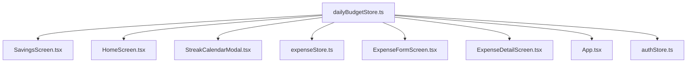

# Technical Architecture Map: `src/store/dailyBudgetStore.ts`

> [!NOTE]
> **Historical Snapshot (Pre-Refactor, September 2026)**
> This document reflects `src/store/dailyBudgetStore.ts` prior to the architectural decomposition and bug fixes in mid-September 2026. Exact line numbers, function catalogs, and specific helper implementations have evolved. For the current system-level picture, read [`docs/architecture.md §6`](../architecture.md) first. For live behavior, refer to [`src/store/dailyBudgetStore.ts`](file:///d:/Arthik-App/src/store/dailyBudgetStore.ts), [`src/lib/budgetCalculations.ts`](file:///d:/Arthik-App/src/lib/budgetCalculations.ts), and [`src/lib/budgetUtils.ts`](file:///d:/Arthik-App/src/lib/budgetUtils.ts).

This document provides a comprehensive, read-only deep-dive function catalog of `src/store/dailyBudgetStore.ts` (reduced from 1,142 lines to 958 after extracting calculation helpers to `src/lib/budgetCalculations.ts`). It adheres strictly to the domain vocabulary defined in [CONTEXT.md](file:///d:/Arthik-App/CONTEXT.md) and cites exact lines and verified code.

---

## 1. Inventory of Functions

Every internal and exported function in `src/store/dailyBudgetStore.ts` is catalogued below.

| # | Name | Line(s) | Category | Description |
|---|------|---------|----------|-------------|
| 1 | `registerExpenseGetter` | 9–11 | **STATE-MUTATING** | Registers an external getter callback from `expenseStore` to populate the module-scoped `expenseGetter` variable. |
| 2 | `getCurrentExpenses` | 12–14 | **CROSS-STORE** | Invokes the registered `expenseGetter` callback to retrieve current expenses from `useExpenseStore`. |
| 3 | `buildCategoryClassifier` | 22–32 | **CROSS-STORE** | Constructs an in-memory `Map<string, Category>` from `useCategoryStore.getState().categories` and returns an `(e: Expense) => boolean` predicate delegating directly to `isIncomeTransaction(e, cat)`. Replaces deleted `getIncomeCategoryIds`. |
| 4 | `getPendingSettingsKey` | 61–62 | **PURE** | Formats and returns the per-user AsyncStorage key string (`@arthik_pending_settings_${userId}`). |
| 5 | `savePendingSettingsOffline` | 63–76 | **STORAGE** | Reads, merges, and writes pending profile budget updates (`daily_budget`, `is_auto_renew`) to AsyncStorage. |
| 6 | `clearPendingSettingsOffline` | 78–100 | **STORAGE** | Removes or clears specific keys from the offline pending settings entry in AsyncStorage. |
| 7 | `getTodayDateStr` | 133 | **SYSTEM-TIME** | Reads device clock via `new Date()` and formats as `'yyyy-MM-dd'`. |
| 8 | `getTodayRecord` | 150–158 | **STORE-READ** | Retrieves today's `DailyRecord` from store state or synthesizes an unfinalized active record via `buildDefaultTodayRecord`. |
| 9 | `getPastRecordsList` | 160–164 | **STORE-READ** | Filters all stored `dailyRecords` for dates `< todayStr` and sorts them in descending order via `filterPastRecords`. |
| 10 | `setDailyBudget` | 166–220 | **MIXED** | Updates profile recurring allowance and today's record in store, recalculates metrics, queues offline patch in AsyncStorage, and syncs update to Supabase `profiles`. |
| 11 | `toggleAutoRenew` | 222–271 | **MIXED** | Updates `isAutoRenew` in store, ensures today's budget is populated if turning ON, recalculates metrics, queues offline patch, and syncs update to Supabase `profiles`. |
| 12 | `setTodayBudget` | 273–293 | **CROSS-STORE** | Overrides today's record budget without changing profile baseline, and recalculates metrics. |
| 13 | `addToTodayBudget` | 295–318 | **CROSS-STORE** | Increments today's record budget by an additional top-up amount, and recalculates metrics. |
| 14 | `syncWithExpenses` | 320–417 | **MIXED** | Calculates live spent for today via `computeSpentForDate`, updates store state, checks 80%/100% threshold notifications (`notificationStore` + native module), and triggers `checkAndRollover`. |
| 15 | `checkAndRollover` | 419–626 | **MIXED** | Evaluates and finalizes past days, calculates spent via `computeSpentByDate` and status via `evaluateDayStatus`, upserts to Supabase `daily_savings_log` using `shouldIgnoreDuplicates(status)`, fires rollover notification, and recalculates metrics. |
| 16 | `uploadPendingDailyRecords` | 628–674 | **MIXED** | Scans `dailyRecords` for `needsUpload === true`, upserts them to Supabase `daily_savings_log` using `shouldIgnoreDuplicates(status)`, and clears `needsUpload`. |
| 17 | `hydrateFromSupabase` | 676–941 | **MIXED** | Startup hydration: waits for persist rehydration, resets state if user switched, sets notification owner, reads pending offline settings, fetches Supabase `profiles` and `daily_savings_log`, executes self-healing logic for corrupted records, recalculates metrics, triggers `checkAndRollover`, and flushes pending uploads. |
| 18 | `resetDailyBudget` | 943–958 | **STORAGE** | Resets all Zustand store attributes to defaults and wipes `'arthik-daily-budget-storage-v2'` from AsyncStorage. |
| 19 | Store Reset Callback Subscription | 956–958 | **CROSS-STORE** | Subscribes `resetDailyBudget` to `authStore` via `registerStoreResetCallback`. |

> [!NOTE]
> **Extracted Pure Modules (`src/lib/budgetCalculations.ts`)**:
> `calculateSavingsMetrics` (lines 27–146), `evaluateDayStatus` (lines 156–178), `computeSpentByDate` (lines 204–226), `computeSpentForDate` (lines 228–242), `buildDefaultTodayRecord` (lines 247–261), `filterPastRecords` (lines 266–274), and `shouldIgnoreDuplicates` (lines 283–285) now reside in `src/lib/budgetCalculations.ts` as pure, testable functions and are re-exported by `dailyBudgetStore.ts`.

> [!WARNING]
> **The MIXED Functions**:
> Functions **#10, #11, #14, #15, #16, #17** combine local state mutation, cross-store reads/notifications, and asynchronous storage/Supabase I/O. These 6 functions comprise ~80% of the file's line count and represent the highest blast radius.

---

## 2. The Rules, Stated Exactly

All rules below were extracted directly from the source code.

### 2.1 How a Day's Budget is Decided

A day's budget is derived according to three distinct tiers:

1. **Recurring Allowance (Base Daily Budget)**:
   - Configured via `setDailyBudget(amount)` (lines 272–326).
   - Sanitized via `cleanAmount = Math.max(0, Math.round(amount))` (line 273).
   - If `cleanAmount > 0`, `isAutoRenew` is forced to `true` (`willAutoRenew = cleanAmount > 0 ? true : get().isAutoRenew`, line 276).
   - Applies automatically to any new day when `isAutoRenew` is `true`.
2. **Per-Day Override (Day's Allowance)**:
   - Configured via `setTodayBudget(amount)` (lines 379–399).
   - Sanitized via `cleanAmount = Math.max(0, Math.round(amount))` (line 380).
   - Modifies `records[todayStr].budget` directly (line 392); leaves profile `dailyBudgetAmount` and `isAutoRenew` untouched.
3. **Top-Up (`addToTodayBudget`)**:
   - Configured via `addToTodayBudget(extraAmount)` (lines 401–424).
   - Sanitized via `cleanExtra = Math.max(0, Math.round(extraAmount))` (line 402). If `cleanExtra <= 0`, it is a no-op (line 403).
   - If no record exists for today, initializes base budget to `isAutoRenew ? dailyBudgetAmount : 0` (line 409).
   - Sets `newBudget = currentToday.budget + cleanExtra` (line 416).
4. **Day Where the User Set Nothing (Unset / Fresh Day)**:
   - In `getTodayRecord()` (lines 253–254): If no record exists in `dailyRecords`, budget is `get().isAutoRenew ? get().dailyBudgetAmount : 0`. If `isAutoRenew` is `false`, budget is strictly `0`.
   - In `syncWithExpenses()` (line 446): If `!todayRecord`, budget is `get().isAutoRenew && get().dailyBudgetAmount > 0 ? get().dailyBudgetAmount : 0`.
   - In `hydrateFromSupabase()` (lines 1077, 1086–1089): If `!records[todayStr]`, budget is `resolvedAutoRenew && resolvedBudget > 0 ? resolvedBudget : 0`. If a record exists but has `budget === 0` while `isFinalized === false` and `resolvedAutoRenew === true`, it is updated to `resolvedBudget`.
   - In `checkAndRollover()` for historical days without records (lines 613–626):
     ```ts
     615: if (get().isAutoRenew && get().dailyBudgetAmount > 0) {
     616:   budget = get().dailyBudgetAmount;
     617:   saved = Math.max(0, budget - spent);
     618:   status = spent > budget ? 'exceeded' : saved > 0 ? 'saved' : 'even';
     619: } else if (spent > 0) {
     620:   status = 'unknown';
     621:   budget = 0;
     622:   saved = 0;
     623: } else {
     624:   // No prior record, 0 budget, 0 spent: skip
     625:   continue;
     626: }
     ```
   - In `checkAndRollover()` for historical days with existing record having `budget === 0` (lines 628–638): If `isAutoRenew && dailyBudgetAmount > 0`, retroactively assigns `budget = dailyBudgetAmount`; otherwise, locks `status = 'unknown'`, `budget = 0`, `saved = 0`.

### 2.2 How "Spent" is Computed and Excluded Transactions

The computation of spent delegates to pure helpers `computeSpentForDate` and `computeSpentByDate` in `src/lib/budgetCalculations.ts` (lines 204–242) using `isIncomeFn = buildCategoryClassifier()`:

- In `syncWithExpenses` (lines 323–325):
  ```ts
  const isIncomeFn = buildCategoryClassifier();
  const todaySpent = computeSpentForDate(expenses, todayStr, isIncomeFn);
  ```
- In `checkAndRollover` (lines 430–433) and `hydrateFromSupabase` (lines 766–767):
  ```ts
  const isIncomeFn = buildCategoryClassifier();
  const spentByDate = computeSpentByDate(expenses, isIncomeFn);
  ```

Inside `computeSpentForDate` and `computeSpentByDate`, each expense is inspected via the extracted predicate `extractDateAndAmount(e, isIncomeFn)`:
```ts
const isIncome = isIncomeFn ? isIncomeFn(e) : isIncomeTransaction(e);
if (isIncome) return null;
const cleanDate = e.expense_date?.split('T')[0]?.trim();
if (!cleanDate) return null;
const amount = Number(e.amount) || 0;
```

**Excluded Transactions**:
1. **Income Transactions**: Excluded if `isIncomeFn(e)` evaluates to `true`, which uses `buildCategoryClassifier()` (lines 22–32) to look up the transaction's category from `useCategoryStore` and delegate directly to `isIncomeTransaction(e, cat)` (checks explicit `type` first, then category name keywords).
2. **Date Mismatches**: Excluded if `cleanDate !== targetDate`.
3. **Pre-Registration Transactions**:
   - In `calculateSavingsMetrics` (lines 40–43): `if (userCreatedAt && r.date < userCreatedAt) return;`
   - In `checkAndRollover` (lines 452–460): Any record where `d < userCreatedAtStr` is purged from state via `delete records[d]` and skipped.
   - In `hydrateFromSupabase` (line 778): Any log entry where `d < userCreatedAtStr` is ignored.
4. **Invalid Amounts**: Transactions with `NaN` or non-numeric amounts resolve to `0` via `Number(e.amount) || 0`.

### 2.3 How "Saved" is Computed

- **For Active / Today Records**:
  - Formula: `saved = Math.max(0, budget - spent)` (lines 177, 234, 287, 312, 336, 352).
  - Unspent allowance is calculated in real time. If `spent >= budget`, `saved` is `0`.
- **For Finalized Past Days**:
  - In `checkAndRollover` (lines 500, 510) via `evaluateDayStatus(budget, spent)`: `saved = Math.max(0, budget - spent)`.
  - If `status === 'unknown'`: `saved = 0`.
  - In `hydrateFromSupabase` (lines 847–853) via `evaluateDayStatus(dayBudget, daySpent, 'unknown')`:
    - If `dayBudget <= 0`: `daySaved = 0`, `status = 'unknown'`.
    - If `dayBudget > 0`: `daySaved = Math.max(0, dayBudget - daySpent)`.

### 2.4 When a Day Becomes Finalized and What Triggers It

- **Definition of Finalized**: `DailyRecord.isFinalized === true`. The day's metrics are permanently frozen and queued for remote sync to `daily_savings_log` (`needsUpload: true`).
- **Condition for Finalization**: A day is finalized **only if it is strictly in the past** (`d < todayStr`). Today is **never** finalized (`isFinalized: false`, lines 178, 235, 282, 306, 337, 896).
- **Execution Triggers**:
  1. **At the end of `syncWithExpenses(expenses)`** (line 416): Called whenever an expense is added, edited, deleted, or refreshed.
  2. **In `hydrateFromSupabase(userId)`** (line 935): Called upon user authentication or refresh.
- **Roll-over Workflow (`checkAndRollover`)**:
  - Scans all past dates (`pastDates = new Set(...)`, lines 436–449) derived from existing `dailyRecords` keys `< todayStr` unioned with all expense dates `< todayStr`.
  - For each date `d >= userCreatedAtStr`, if any metric changed or `!existing.isFinalized`, sets `isFinalized: true`, `needsUpload: true`, and triggers an asynchronous upsert to Supabase `daily_savings_log` (lines 550–563) with `ignoreDuplicates: shouldIgnoreDuplicates(status)`.

### 2.5 How Each Status is Chosen

1. **Active (`status: 'active'`)**:
   - Chosen exclusively for **today** when `todaySpent <= budget || budget === 0` (lines 179, 236, 283, 307, 338, 897).
   - If `budget === 0`, today remains `'active'` even if `todaySpent > 0`.
2. **Exceeded (`status: 'exceeded'`)**:
   - For today: when `todaySpent > budget && budget > 0` (lines 184, 236, 288, 313, 338, 345).
   - For past days: in `checkAndRollover` and `hydrateFromSupabase` via `evaluateDayStatus`, when `spent > budget && budget > 0`.
3. **Saved (`status: 'saved'`)**:
   - For finalized past days where `budget > 0`, `spent <= budget`, and `saved > 0` (via `evaluateDayStatus`).
4. **Even (`status: 'even'`)**:
   - For finalized past days where `budget > 0`, `spent === budget`, and `saved === 0` (via `evaluateDayStatus`).
5. **Unknown (`status: 'unknown'`)**:
   - Past days where no budget was allocated (`budget === 0`) and `spent === 0` or `spent > 0` (via `evaluateDayStatus(budget, spent, 'unknown')`).
   - Uniformly assigned in both `checkAndRollover` (line 500) and `hydrateFromSupabase` (line 849), preserving user streaks across untracked days (Ticket 03 resolved).

> [!IMPORTANT]
> **Resolution of Past Discrepancies**:
> - **Code vs `schema.sql`**: `schema.sql` line 152 enforces check constraint `CHECK (status IN ('saved', 'missed', 'even', 'unknown'))`. In `dailyBudgetStore.ts`, the TypeScript interface uses `'exceeded'`. When sending to Supabase, lines 541–545 and 641–645 translate `'exceeded'` into `'missed'`.
> - **Status 'unknown' Uniformity (Ticket 03)**: The former discrepancy where `hydrateFromSupabase` assigned `'even'` to zero-budget zero-spend days has been resolved. Both `checkAndRollover` and `hydrateFromSupabase` now evaluate zero-budget zero-spend days as `'unknown'`, preventing untracked days from breaking streaks.
> - **Upsert Duplication Safeguard (Ticket 02)**: In `checkAndRollover` (line 546), `isInsertOnly` is now governed by `shouldIgnoreDuplicates(status)` (`status === 'unknown'`), ensuring that first-time finalization of tracked days (`'saved'`, `'exceeded'`, `'even'`) genuinely overwrites remote records in `daily_savings_log`.

### 2.6 How the Streak is Computed

The savings streak is computed by `calculateSavingsMetrics` (lines 80–102):

```ts
80:  let streak = 0;
81:  let dayCheck = subDays(new Date(), 1);
82:  while (true) {
83:    const dStr = format(dayCheck, 'yyyy-MM-dd');
84:    if (userCreatedAt && dStr < userCreatedAt) {
85:      break;
86:    }
87:    const rec = records[dStr];
88:    if (rec && rec.isFinalized) {
89:      // 'unknown' days neither extend nor break the streak: skip and continue checking earlier days
90:      if (rec.status === 'unknown') {
91:        dayCheck = subDays(dayCheck, 1);
92:        continue;
93:      }
94:      if (rec.status === 'saved' && (rec.saved || 0) > 0) {
95:        streak++;
96:        dayCheck = subDays(dayCheck, 1);
97:        continue;
98:      }
99:    }
100:   // Any other status (exceeded, even, active, or missing unfinalized day) breaks the streak
101:   break;
102: }
```

- **What Extends the Streak**: Only a finalized past day with `rec.status === 'saved'` and `rec.saved > 0` (lines 94–98).
- **What Breaks the Streak**:
  - `status === 'exceeded'`
  - `status === 'even'`
  - `status === 'active'` (an unfinalized past record)
  - Missing day in `records` (`!rec`)
  - Unfinalized day (`!rec.isFinalized`)
  - Reaching registration boundary (`dStr < userCreatedAt`) terminates evaluation cleanly.
- **What is Neutral**: `rec.status === 'unknown'` (lines 90–93). It advances `dayCheck` by 1 without incrementing `streak` and without breaking the loop.
- **Streak Guards & Best Streak**:
  - Lines 144–149: If `confirmedSavedDays === 0`, `streak = 0` and `maxStreak = 0`. If `streak > confirmedSavedDays`, `streak = confirmedSavedDays`. **Note (Ticket 06)**: While `streak` is clamped to `confirmedSavedDays`, `maxStreak` (and therefore `bestStreak`) is **not** clamped by `confirmedSavedDays` whenever `confirmedSavedDays > 0`. Moreover, `finalizedSavedRecords` does not filter out pre-registration days (`< userCreatedAt`), meaning a pre-registration streak can become the user's `bestStreak` once a single post-registration day is saved.
  - Best streak gap bridging (lines 111–121): Identifies the longest contiguous sequence of saved records in historical order, treating intermediate days as neutral bridges only if explicitly recorded with `status === 'unknown'`. **Note (Ticket 07)**: Missing records (`records[d] === undefined`) evaluate `records[d]?.status !== 'unknown'` to `true` and actively **break** the bridge rather than bridging it.

### 2.7 How `totalAccumulatedSavings` is Computed

Total accumulated savings (Gullak) is computed in `calculateSavingsMetrics` (lines 44–74):

```ts
44:  let totalSaved = 0;
45:  let totalOverspent = 0;
46:  const userCreatedAt = userCreatedAtStr || useAuthStore.getState().user?.created_at?.split('T')[0]?.trim();
47:
48:  Object.values(records).forEach((r) => {
49:    // Check confirmed finalized past days that are on or after the user registered
50:    if (r.isFinalized && r.date < todayStr) {
51:      if (userCreatedAt && r.date < userCreatedAt) {
52:        // Pre-registration backdated days do not affect Gullak savings or penalty
53:        return;
54:      }
55:      // 'unknown' days do not affect Gullak savings or penalties
56:      if (r.status === 'unknown') {
57:        return;
58:      }
59:      if (r.budget > 0 && r.spent > r.budget) {
60:        totalOverspent += (r.spent - r.budget);
61:      } else if ((r.saved || 0) > 0) {
62:        totalSaved += (r.saved || 0);
63:      }
64:    }
65:  });
66:
67:  // Include today's live overspend if user spent more than today's budget
68:  const todayRec = records[todayStr];
69:  if (todayRec && todayRec.budget > 0 && todayRec.spent > todayRec.budget) {
70:    totalOverspent += (todayRec.spent - todayRec.budget);
71:  }
72:
73:  // Net accumulated savings cannot drop below 0
74:  const netSavings = Math.max(0, totalSaved - totalOverspent);
```

- **Inclusion of Past Savings**: Sum of all `r.saved` from finalized past days (`r.isFinalized && r.date < todayStr && r.date >= userCreatedAt`).
- **Overspending Penalties**:
  - **Past Overspending**: Every past finalized day where `r.budget > 0 && r.spent > r.budget` adds `r.spent - r.budget` directly to `totalOverspent` (lines 59–60).
  - **Live Today Overspending**: If today's live spending exceeds today's budget (`todayRec.budget > 0 && todayRec.spent > todayRec.budget`), the live deficit `todayRec.spent - todayRec.budget` is added immediately to `totalOverspent` (lines 68–71).
  - Today's unfinalized *savings* are **never** added to `totalSaved` until the day rolls over and finalizes. However, today's *overspending* immediately penalizes the accumulated balance.
- **Floor**: Net accumulated savings can never drop below zero: `Math.max(0, totalSaved - totalOverspent)` (line 74).

---

## 3. Date Boundaries & Timezone Sensitivities

The following table documents every location in `dailyBudgetStore.ts` where dates are resolved, compared, or manipulated.

| Line(s) | Code Snippet | Reference Time | Boundary & Timezone Consequence |
|---------|--------------|----------------|---------------------------------|
| 46 | `user?.created_at?.split('T')[0]?.trim()` | **UTC** | Supabase stores `created_at` in UTC. Splitting at `'T'` takes the UTC date. For an Indian user (UTC+5:30) registering at 2:00 AM IST on Sept 19, the UTC date is `'2026-09-18'`. Backdated transactions logged on Sept 18 will be treated as post-registration rather than pre-registration. |
| 50 | `if (r.isFinalized && r.date < todayStr)` | **String Comparison** | Lexicographical date comparison. Safe assuming `'yyyy-MM-dd'`. |
| 81 | `subDays(new Date(), 1)` | **Local Time** | Subtracts 1 day from current device clock. Crossing midnight will shift `dayCheck` by 1 day immediately upon the next function invocation. |
| 115–116 | `new Date(rec.date)` | **UTC / Engine-dependent** | ECMAScript specifies that date-only strings like `'2026-09-18'` parse as **UTC midnight**. In timezones west of UTC (e.g. UTC-5 New York), `new Date('2026-09-18')` is 7:00 PM Sept 17 local time. |
| 124–126 | `intermediateDate.setDate(prevDate.getDate() + step)` | **Local Time on UTC Date** | `prevDate.getDate()` invokes local day-of-month on a Date object parsed at UTC midnight. For users west of UTC, this shifts the date backwards by 1 day, causing `intermediateStr = format(intermediateDate, 'yyyy-MM-dd')` to evaluate wrong intermediate dates and potentially corrupt `bestStreak`. |
| 229 | `format(new Date(), 'yyyy-MM-dd')` | **Local Time** | Baseline `getTodayDateStr()` generator. Anchors "today" to device local clock. |
| 436, 551, 894 | `e.expense_date?.split('T')[0]?.trim()` | **Stored Date String** | Extracts date string from transaction. If `expense_date` is stored as an ISO timestamp rather than date-only, splitting at `'T'` extracts the UTC day, which may differ from the user's local entry day. |
| 573, 956, 1059 | `format(subDays(new Date(), 1), 'yyyy-MM-dd')` | **Local Time** | Generates `yesterdayStr` based on device clock. |
| 712 | `if (d === yesterdayStr && saved > 0 ...)` | **Local Time** | Rollover notification only triggers for `yesterdayStr`. If a user does not open the app for 2 days, day before yesterday rolls over silently with no notification. |

---

## 4. The Income Inconsistency (Resolved)

### 4.1 Resolution of Dual-Engine Inconsistency
The dual-engine divergence between `paymentUtils.ts` and `dailyBudgetStore.ts` (documented in ADR 0007, superseded by ADR 0008) has been completely resolved.

`getIncomeCategoryIds` was deleted from `dailyBudgetStore.ts`. Both UI screens and the budget engine now standardize strictly on the shared helper `isIncomeTransaction(item, category)` from `src/lib/paymentUtils.ts`:

1. **Category Map Classifier (`src/store/dailyBudgetStore.ts:22–32`)**:
   ```ts
   const buildCategoryClassifier = (): ((e: Expense) => boolean) => {
     const categories = useCategoryStore.getState().categories;
     const categoryMap = new Map<string, Category>();
     for (let i = 0; i < categories.length; i++) {
       categoryMap.set(categories[i].id, categories[i]);
     }
     return (e: Expense): boolean => {
       const cat = e.category_id ? categoryMap.get(e.category_id) : undefined;
       return isIncomeTransaction(e, cat);
     };
   };
   ```
2. **Standardized Invocation**: Invoked in `syncWithExpenses` (line 323), `checkAndRollover` (line 430), and `hydrateFromSupabase` (line 766), passing `isIncomeFn` into pure calculation functions `computeSpentForDate` and `computeSpentByDate`.

### 4.2 Startup Window Sequencing & Residual Risk

To close the failure window where categories were empty on cold start, startup initialization in `App.tsx` (lines 116–120) was resequenced:

```ts
116: await fetchCategories(true);
117: await Promise.all([
118:   fetchExpenses(),
119:   useDailyBudgetStore.getState().hydrateFromSupabase(session.user.id),
120: ]);
```

**Residual Risk Analysis**:
1. **Online vs Offline Cold Start**: When online, `fetchCategories(true)` fetches fresh categories from Supabase. When offline, `categoryStore.fetchCategories` rehydrates cached categories from AsyncStorage (`@arthik_cached_categories_${userId}`), ensuring the category map is populated before expenses and budget logs are evaluated.
2. **Fresh Offline Install (Edge Case)**: The only scenario where categories remain empty is a brand-new, unauthenticated offline install where no cache exists. Because `session?.user?.id` is null on unauthenticated launch, neither `fetchExpenses` nor `hydrateFromSupabase` executes. As soon as a user authenticates, categories are fetched and cached first.
3. **Explicit Transaction Types**: All transactions created or modified in modern app versions write an explicit `type` column (`'expense' | 'income'`). Because `isIncomeTransaction` checks `item?.type === 'income'` and `item?.type === 'expense'` before category keywords, category lookup latency only affects legacy untyped rows (`type: undefined`).

### 4.3 Historical Worked Numerical Example (Pre-Fix vs Post-Fix)

**Scenario**:
- User has a Recurring Allowance of **₹500** (`dailyBudgetAmount: 500`, `isAutoRenew: true`).
- User's previous Gullak accumulated savings: **₹1,500**.
- User's current Savings Streak: **5 days**.
- Today, the user logs two transactions:
  1. Grocery shopping: **₹300**, `type: 'expense'`.
  2. Freelance consulting payout: **₹2,000**, `category_id: 'cat_freelance'` (Category name: "Freelance Work"), `type: undefined` (legacy/untyped row).

**Comparison of Behavior**:

| Metric | Screen Layer | Budget Engine (Pre-Fix) | Budget Engine (Post-Fix) |
|---|---|---|---|
| **Tx 2 Classification** | **Income** (`isIncomeTransaction`) | **Expense** (`incomeIds` was empty) | **Income** (`isIncomeTransaction(e, cat)`) |
| **Today's Spent** | **₹300** | **₹2,300** (+₹2,000 inflation) | **₹300** (Accurate) |
| **Today's Remaining / Saved** | **₹200** (`500 - 300`) | **₹0** (Savings eliminated) | **₹200** (`500 - 300`) |
| **Today's Status** | **Under Budget** (`active`) | **Exceeded** (False failure) | **Under Budget** (`active`) |
| **Overspend Penalty** | **₹0** | **₹1,800** penalty | **₹0** |
| **Gullak Reserve** | **₹1,500** intact | **₹0** (Wiped out) | **₹1,500** intact |
| **Savings Streak Tomorrow** | **6 days** (extended) | **0 days** (Streak broken) | **6 days** (Extended) |
| **Device Notifications** | None | **`🚨 Daily Allowance Exceeded!`** | None (No false alarm) |

---

## 5. What Depends on This File (Blast Radius)

The following components, screens, and stores import and depend on `dailyBudgetStore.ts`:



### 5.1 Consumers & Selectors

1. **`src/screens/SavingsScreen.tsx`**:
   - `dailyBudgetAmount` (line 161)
   - `isAutoRenew` (line 162)
   - `totalAccumulatedSavings` (line 163)
   - `savingsStreak` (line 164)
   - `bestStreak` (line 165)
   - `setDailyBudget` (line 166)
   - `toggleAutoRenew` (line 167)
   - `setTodayBudget` (line 168)
   - `addToTodayBudget` (line 169)
   - `syncWithExpenses` (line 170)
   - `dailyRecords` (line 171)
   - `getTodayRecord` (line 172)
   - `getPastRecordsList` (line 173)
2. **`src/screens/HomeScreen.tsx`**:
   - `dailyBudgetAmount` (line 249)
   - `isAutoRenew` (line 250)
   - `totalAccumulatedSavings` (line 251)
   - `getTodayRecord` (line 252)
   - `dailyRecords` (line 253)
   - `syncWithExpenses` (line 254)
   - `hydratedForUserId` via `getState().hydratedForUserId` (line 265)
   - `hydrateFromSupabase` via `getState().hydrateFromSupabase` (lines 266, 289)
3. **`src/components/StreakCalendarModal.tsx`**:
   - `savingsStreak` (line 44)
   - `bestStreak` (line 45)
   - `dailyRecords` (line 46)
4. **`src/store/expenseStore.ts`**:
   - `registerExpenseGetter` (lines 6, 1082)
   - `useDailyBudgetStore.getState().syncWithExpenses(...)` (lines 306, 677, 776, 790, 830, 870, 879, 916, 936, 1016, 1021)
   - `useDailyBudgetStore.getState().uploadPendingDailyRecords()` (line 672)
5. **`src/screens/ExpenseFormScreen.tsx`**:
   - `useDailyBudgetStore.getState().syncWithExpenses(...)` (line 623)
6. **`src/screens/ExpenseDetailScreen.tsx`**:
   - `useDailyBudgetStore.getState().syncWithExpenses(...)` (line 63)
7. **`App.tsx`**:
   - `useDailyBudgetStore.getState().hydrateFromSupabase(...)` (line 119)
   - `useDailyBudgetStore.getState().uploadPendingDailyRecords()` (line 144)
8. **`src/store/authStore.ts`**:
   - Registered reset callback: `registerStoreResetCallback` (line 1139 of `dailyBudgetStore.ts`).

---

## 6. Extraction Status & Remaining Candidates

The table below reflects the current extraction status and remaining candidates:

| Rank | Candidate / Functionality | Current Location | Status | Rationale & Safety |
|---|---|---|---|---|
| **Extracted** | `evaluateDayStatus` | `src/lib/budgetCalculations.ts:156–178` | **EXTRACTED** | Pure decision function. Guarantees identical status across rollover and hydration. |
| **Extracted** | `calculateSavingsMetrics` | `src/lib/budgetCalculations.ts:27–146` | **EXTRACTED** | Pure mathematical aggregation accepting explicit `todayStr`, `userCreatedAtStr`, and `referenceDate`. |
| **Extracted** | `computeSpentByDate` & `computeSpentForDate` | `src/lib/budgetCalculations.ts:204–242` | **EXTRACTED** | Single-pass date grouping and single-date spending calculation using injected `isIncomeFn`. |
| **Extracted** | `buildDefaultTodayRecord` | `src/lib/budgetCalculations.ts:247–261` | **EXTRACTED** | Pure fallback today record synthesis. |
| **Extracted** | `filterPastRecords` | `src/lib/budgetCalculations.ts:266–274` | **EXTRACTED** | Pure projection filtering out today's record and sorting past records descending. |
| **Extracted** | `shouldIgnoreDuplicates` | `src/lib/budgetCalculations.ts:283–285` | **EXTRACTED** | Pure domain decision returning `status === 'unknown'` for Supabase upsert deduplication. |
| **Deleted** | `getIncomeCategoryIds` | `src/store/dailyBudgetStore.ts:22–32` | **RESOLVED / DELETED** | Eliminated in favor of `buildCategoryClassifier()` delegating directly to `isIncomeTransaction`. |
| **1 (Safe)** | `getPendingSettingsKey` | `src/store/dailyBudgetStore.ts:61–62` | Candidate | Pure key generator. Zero side effects. |
| **Cannot Extract** | `savePendingSettingsOffline` / `clearPendingSettingsOffline` | `src/store/dailyBudgetStore.ts:63–100` | N/A | Direct I/O with `AsyncStorage`. Belongs in a storage/repository layer. |
| **Cannot Extract** | `syncWithExpenses`, `checkAndRollover`, `hydrateFromSupabase` | `src/store/dailyBudgetStore.ts:320–941` | N/A | Complex state orchestrators combining network I/O, Supabase RPCs, native notification bridges, and cross-store side effects. |

---

## 7. What You Are Unsure About

During the audit, several non-obvious design decisions, heuristics, and potential edge-case bugs were identified. Their current resolution status is recorded below:

1. **The 500 "OTA Update Bug" Heuristic Deletion Logic (Resolved — Ticket 01)**:
   - *Previous state*: Lines 974–990 previously deleted historical rows from Supabase and local store if `daySpent === 0 && (rawLogBudget === 500 || rawLogSaved === 500)`. This risked permanently deleting legitimate ₹500 zero-spend days.
   - *Resolution*: Unsafe deletion was eliminated and replaced by `resolveHydratedDayBudget` in `src/lib/budgetUtils.ts`, which safely infers true budgets without destructive row purging.
2. **Use of `ignoreDuplicates: isInsertOnly` in `checkAndRollover` (Resolved — Ticket 02)**:
   - *Previous state*: Line 672 defined `const isInsertOnly = status === 'unknown' || wasUnfinalized;`. Because `wasUnfinalized` was `true` on every day's first rollover, Supabase executed `ON CONFLICT DO NOTHING`, silently discarding finalized metrics if a row already existed remotely.
   - *Resolution*: Line 546 now uses `const isInsertOnly = shouldIgnoreDuplicates(status);` (`status === 'unknown'`). Real finalized days (`'saved'`, `'exceeded'`, `'even'`) genuinely overwrite remote records.
3. **Date Shifting in `bestStreak` Calculation (`src/lib/budgetCalculations.ts:115–134`)**:
   - Line 116 creates `new Date(rec.date)` from a `'yyyy-MM-dd'` string. Line 125 modifies it via `intermediateDate.setDate(prevDate.getDate() + step)`.
   - *Uncertainty*: Because `new Date('yyyy-MM-dd')` standardizes on UTC midnight while `.getDate()` and `.setDate()` operate on client local time, users operating in timezones west of UTC (e.g. UTC-4 to UTC-10) may experience corrupted `bestStreak` counts due to date shifting across day boundaries.
4. **Zero-Spend Zero-Budget Day Assigned Status `'even'` (Resolved — Ticket 03)**:
   - *Previous state*: In `hydrateFromSupabase`, line 1015 set `evaluatedStatus = daySpent > 0 ? 'unknown' : 'even'`. A zero-budget zero-spend day loaded from Supabase was assigned `'even'`, which broke the user's savings streak.
   - *Resolution*: `hydrateFromSupabase` (line 849) now uses `evaluateDayStatus(dayBudget, daySpent, 'unknown')`, which returns `'unknown'` for zero-budget zero-spend days, preserving streaks uniformly across both rollover and hydration.
5. **Notification Race Condition on Startup**:
   - `syncWithExpenses` triggers `checkAndRollover(expenses)` with `skipRolloverNotification = false`.
   - `hydrateFromSupabase` triggers `checkAndRollover(currentExpenses, true)` with `skipRolloverNotification = true`.
   - In `App.tsx` (lines 116–120), `fetchExpenses()` and `hydrateFromSupabase()` run in `Promise.all`.
   - *Uncertainty*: If `fetchExpenses()` finishes first, `useExpenseStore` calls `syncWithExpenses()` before `hydrateFromSupabase()` sets `hydratedForUserId`. Line 422 blocks execution (`if (get().hydratedForUserId !== currentUser.id) return;`). Then `hydrateFromSupabase()` finishes and calls `checkAndRollover(currentExpenses, true)` which skips notifications. If `syncWithExpenses` is not subsequently re-invoked, does the user miss yesterday's rollover celebration notification entirely?
