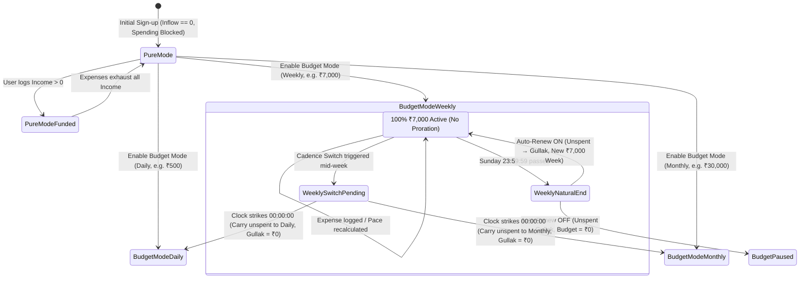

# Technical Implementation Specification: Arthik Unified Budgeting Architecture

## 1. Problem Statement
Arthik's core value proposition is financial discipline grounded in real-world monetary truth. However, past iterations suffered from three foundational flaws:
1. **Mathematical Proration Flaw**: Slicing user-entered weekly or monthly budgets into fractional days (`fullBudget * remainingDays / totalDays`) violated the foundational Real-Money Invariant. Users who allocated ₹7,000 for a week starting Friday found their budget reduced to a fraction, conflicting with their mental model of real cash allocation.
2. **Missing Vault Spending Guard**: Users in Pure Mode (or with unconfigured budgets) could record expenses with zero available funds, creating artificial negative balances or recording outflows out of thin air.
3. **Ambiguity Between Cycle Completion vs Mid-Cycle Switching**: The mechanics of unspent funds on mid-cycle cadence transitions required formal codification: Gullak deposits must strictly happen *only* on natural cycle completion, while mid-cycle switches must carry forward into the new cadence without artificial proration or premature Gullak credits.

---

## 2. Solution Overview
This specification unifies Arthik's budgeting, transaction, and savings pipelines into a deterministic, real-money engine:
1. **Zero-Proration Policy**: A user's entered budget is 100% active and unreduced, regardless of what calendar day they configure or switch it. Dynamic pacing (`suggestedDailyPace`) provides non-binding guidance.
2. **Digital Bank Vault (Zero-Balance Spending Guard)**: Arthik functions as a financial vault. If total available liquidity (allocated active budget + logged incomes + reserves) equals zero, expense creation is blocked at the input boundary.
3. **Natural Cycle Rollover vs Cadence Switch Carry-Forward**:
   - **Natural cycle end** (Daily at 23:59:59, Weekly Sunday at 23:59:59, Monthly at month-end): Unspent balance moves 100% to Gullak.
   - **Mid-cycle cadence switch**: Zero Gullak deposit; unspent balance carries forward to the new cadence context (Additive by default, Allocation as option).
4. **Deficit Isolation**: Overspending is absorbed at the income and Gullak layers; it never carries forward as negative budget debt into a new cadence.

---

## 3. User Stories

1. As a user starting a Weekly budget of ₹7,000 on Friday, I want my full ₹7,000 to be active for the weekend without proration, so that my allocated spending cash is not artificially cut.
2. As a user starting mid-period, I want to see a non-binding suggested daily pace (~₹2,333/day for 3 days), so that I can budget my spending across remaining days comfortably.
3. As a user finishing Sunday night with ₹2,000 unspent from my weekly budget, I want that ₹2,000 to roll over into my Gullak at midnight, so that my savings grow automatically.
4. As a user switching mid-week from Weekly to Monthly, I do not want my unspent funds to move to Gullak prematurely; I want them carried forward into my new monthly budget.
5. As a user switching cadences, I want the choice to add my unspent funds on top of my new budget pool (Additive) or count them as a headstart (Allocation).
6. As a user switching cadences, I want the switch to take effect tomorrow at 12:00 AM, so that my current day finishes under my existing cadence without mid-day accounting mess.
7. As a user who overspent by ₹1,500 and switches cadences, I do not want my new cadence to start with a -₹1,500 negative penalty; my deficit should be settled from my income/Gullak reserves.
8. As a first-time user with ₹0 income and no budget, I want the app to block me from adding an expense and prompt me to add income first, so that I cannot create fake negative money.
9. As a user with ₹5,000 in income and a ₹500 daily budget, if I spend ₹800 today, I want the extra ₹300 to be deducted from my income pool without blocking my expense.
10. As a user editing my Weekly budget on Wednesday, I want clear confirmation that my new budget takes effect next Monday, so that I am not surprised when today's card remains unchanged.
11. As a monthly budget user who spends ₹2,500 on a dinner (above my suggested ₹1,000/day pace), I want to know my monthly streak is intact as long as my monthly total is under budget.
12. As a user with Auto-Renew enabled, when my cycle finishes, I want my unspent money saved to Gullak and my new cycle to start automatically with a celebratory summary.
13. As a user with Auto-Renew disabled, when my cycle finishes, I want my savings banked and my new cycle to start with ₹0 (paused) until I set a new budget intentionally.
14. As a user launching the app, I want the Home screen to open to my active cadence view by default, while still allowing me to click other time pills for historical review.
15. As a user deleting an expense from 3 days ago, I want the app to inform me that my past day's savings and Gullak balance will be updated accordingly.

---

## 4. Architectural & Data Model Specifications

### 4.1 Database & Schema (`schema.sql`)
1. **Table `profiles`**:
   - `daily_budget NUMERIC(12, 2) DEFAULT 0`
   - `is_auto_renew BOOLEAN DEFAULT FALSE`
   - `is_budget_mode_enabled BOOLEAN DEFAULT FALSE`
   - `budget_cadence TEXT NOT NULL DEFAULT 'daily' CHECK (budget_cadence IN ('daily', 'weekly', 'monthly'))`
   - `weekly_budget NUMERIC(12, 2) DEFAULT 0`
   - `monthly_budget NUMERIC(12, 2) DEFAULT 0`
2. **Table `budget_plan_changes`**:
   - `id UUID PRIMARY KEY DEFAULT gen_random_uuid()`
   - `user_id UUID NOT NULL REFERENCES auth.users(id) ON DELETE CASCADE`
   - `effective_from DATE NOT NULL` (`yyyy-MM-dd`)
   - `is_enabled BOOLEAN NOT NULL`
   - `cadence TEXT NOT NULL CHECK (cadence IN ('daily', 'weekly', 'monthly'))`
   - `amount NUMERIC(12, 2) NOT NULL DEFAULT 0 CHECK (amount >= 0)`
   - `carry_mode TEXT CHECK (carry_mode IS NULL OR carry_mode IN ('additive', 'allocation'))`
   - `carried_over_amount NUMERIC(12, 2) DEFAULT 0 CHECK (carried_over_amount >= 0)`
   - `created_at TIMESTAMPTZ DEFAULT NOW()`
   - Unique constraint: `UNIQUE (user_id, effective_from)`
3. **Table `budget_periods`**:
   - `id UUID PRIMARY KEY` (`${cadence}_${activeStart}`)
   - `user_id UUID NOT NULL REFERENCES auth.users(id) ON DELETE CASCADE`
   - `cadence TEXT NOT NULL CHECK (cadence IN ('weekly', 'monthly'))`
   - `period_start DATE NOT NULL`
   - `period_end DATE NOT NULL`
   - `active_start DATE NOT NULL`
   - `active_end DATE NOT NULL`
   - `budget_amount NUMERIC(12, 2) NOT NULL CHECK (budget_amount >= 0)`
   - `spent_amount NUMERIC(12, 2) NOT NULL DEFAULT 0 CHECK (spent_amount >= 0)`
   - `amount_saved NUMERIC(12, 2) NOT NULL DEFAULT 0 CHECK (amount_saved >= 0)`
   - `status TEXT NOT NULL CHECK (status IN ('saved', 'missed', 'even', 'unknown'))`
   - `is_prorated BOOLEAN NOT NULL DEFAULT FALSE` (Permanently locked to `FALSE`)
   - `carry_mode TEXT CHECK (carry_mode IS NULL OR carry_mode IN ('additive', 'allocation'))`
   - `carried_over_amount NUMERIC(12, 2) DEFAULT 0`
   - Unique constraint: `UNIQUE (user_id, cadence, active_start)`

---

## 5. Explicit Code Removals (Proration Deprecation)

The following existing code and references must be updated or eliminated:
1. **`src/lib/budgetPeriods.ts`**:
   - Lines 14–15 and line 217 header comments: Remove `Prorated budgets (D4): budget = round2(fullBudget * activeDays / totalDaysInPeriod)`.
   - In `buildPeriodsToFinalize()`: Ensure `isProrated` is hardcoded to `false` and `budgetAmount` is never multiplied by `(activeDays / totalDays)`.
   - In `getCurrentPeriodSummary()`: Ensure `budget` strictly equals `plan.amount` (plus `carriedOverAmount` if `carryMode === 'additive'`).
2. **`src/lib/budgetModeUtils.ts`**:
   - Rename/refactor `getProrationPreview()` to `getUnproratedPacingPreview()`.
   - Remove obsolete references to "prorated allowance" from `previewText` and `explanationText`.
   - Update `ProrationPreview` interface or replace with `UnproratedPacingInfo`.
3. **`src/components/BudgetEditModal.tsx`**:
   - Remove `prorationCard`, `prorationHeaderRow`, `prorationTitle`, `prorationExplanation` CSS classes and replace with `pacingCard` styling.
   - Replace "Prorated Allowance" badges with `⚡ Full Budget Active Immediately (No Proration)`.
4. **`src/screens/FaqScreen.tsx`**:
   - Line 44: Remove sentence *"Any partial period until the next standard cycle is prorated fairly based on remaining days..."*
   - Replace with: *"In Arthik, every rupee is real money. Your entered budget is never prorated or scaled down mid-period. The full amount is active immediately, and unspent money rolls into Gullak when the cycle naturally completes."*
5. **`src/lib/moneyExplainerContent.ts`**:
   - Lines 44–45: Replace `tag: 'Fair Proration'`, `title: 'Prorated allowance for remaining days'` with `tag: 'Real-Money Invariant'`, `title: '100% Full Budget Active (No Proration)'`.

---

## 6. Deterministic Mathematical Formulas

All currency amounts are rounded using `round2(val) = Math.round((val + Number.EPSILON) * 100) / 100`.

### 6.1 Available Liquidity & Zero-Balance Guard
```ts
totalVaultLiquidity = round2(activeCadenceAllowance + availableIncome + externalGullakDeposits)
```
- In **Budget Mode**:
  - `activeCadenceAllowance` = Today's budget (Daily) or Period remaining budget (Weekly/Monthly).
  - If `totalVaultLiquidity <= 0`, blocking guard activates: `canAddExpense = false`.
- In **Pure Mode**:
  - `activeCadenceAllowance = 0`.
  - `totalVaultLiquidity = round2(totalIncome - totalExpenses)`.
  - If `totalVaultLiquidity <= 0`, blocking guard activates: `canAddExpense = false`.

### 6.2 Budget Period Pool Math
```ts
if (carryMode === 'additive') {
  effectiveBudgetPool = round2(targetBudget + carriedOverAmount);
} else {
  // allocation mode or default
  effectiveBudgetPool = targetBudget;
}
```

### 6.3 Budget Remaining & Overspend
```ts
budgetRemaining = round2(Math.max(0, effectiveBudgetPool - spentInCycle));
isOverBudget = spentInCycle > effectiveBudgetPool && effectiveBudgetPool > 0;
overspentAmount = round2(isOverBudget ? spentInCycle - effectiveBudgetPool : 0);
```

### 6.4 Dynamic Pace Suggestions
```ts
remainingDaysInCycle = Math.max(1, differenceInCalendarDays(cycleEndDate, todayDate) + 1);
suggestedDailyPace = Math.round(budgetRemaining / remainingDaysInCycle);

// In Monthly mode:
suggestedWeeklyPace = Math.round((budgetRemaining / remainingDaysInCycle) * 7);

// In Weekly mode (Calendar-Month Projection):
daysInCurrentMonth = getDaysInMonth(todayDate);
projectedMonthlySpend = Math.round((targetBudget / 7) * daysInCurrentMonth);
```

### 6.5 Natural Cycle Rollover to Gullak
```ts
// Evaluated ONLY when todayDate > cycleEndDate
if (isNaturalCycleEnd && !isEarlyCadenceSwitch) {
  gullakRolloverAmount = round2(Math.max(0, effectiveBudgetPool - spentInCycle));
} else {
  gullakRolloverAmount = 0;
}
```

### 6.6 Cadence Switch Carry-Forward
```ts
// Evaluated on premature switch
unspentAtSwitch = round2(Math.max(0, currentEffectiveBudget - currentSpentInSlice));

if (unspentAtSwitch <= 0) {
  // Deficit condition: 0 carry forward
  carriedOverAmount = 0;
} else {
  carriedOverAmount = unspentAtSwitch;
}

gullakDepositAtSwitch = 0; // Strictly 0
```

---

## 7. Safety Invariants & Edge Case Protections

### 7.1 Floating Point Precision
- All arithmetic operations pass through `round2()` to prevent IEEE 754 precision issues (e.g. `0.1 + 0.2 = 0.30000000000000004`).
- No raw floating point sums are stored in database rows or Zustand state.

### 7.2 Duplicate Rollover Prevention (Idempotency)
- Daily savings entries use database unique constraint `UNIQUE (user_id, date)` with upsert conflict targets.
- Budget period entries use unique constraint `UNIQUE (user_id, cadence, active_start)`.
- In-memory `lastPeriodRolloverKey` and `lastRolloverNotifiedDate` prevent duplicate device notifications on app re-focus or repeated hydration.

### 7.3 Duplicate Renewal Prevention
- `lastRenewedPeriodKey` persists in AsyncStorage (`@arthik_last_renewed_period_${userId}`).
- A renewal sheet is displayed only if `lastRenewedPeriodKey !== currentPeriodKey`. Once dismissed or confirmed, it never displays again for the same period.

### 7.4 Timezone & Day-Boundary Safety
- Date strings are stored strictly in `yyyy-MM-dd` format.
- Parsing uses `parseISO(dateStr)` rather than `new Date(dateStr)` to prevent UTC/local date shifts.
- "Today" is strictly evaluated against the user's local device calendar date.

### 7.5 Transaction Edit & Deletion Mutation Safety
- When any transaction is added, edited, or deleted, `syncWithExpenses()` triggers:
  1. Recalculates `spentByDate` in $O(N)$ single-pass.
  2. Re-evaluates status (`saved`, `exceeded`, `even`) for all affected dates.
  3. Recomputes Gullak savings metrics through pure helper `calculateSavingsMetrics()`.
  4. If a past overspending was refunded by deleting an expense, Gullak balance self-heals immediately.

---

## 8. State Transitions & UI Matrix



---

## 9. Backward Compatibility & Data Migration
1. **Existing User Records**:
   - Existing profiles with `is_budget_mode_enabled = true` retain their active cadence.
   - Historical rows in `budget_periods` with `is_prorated = false` continue to load without schema modification.
2. **Backwards-Compatible Store Version**:
   - Zustand persist migration handles version bump to ensure `planChanges` and `budgetPeriods` load cleanly from AsyncStorage without dropping saved Gullak balances.
3. **Zero Data Loss Invariant**:
   - No historical daily records or Gullak deposits are ever cleared or dropped during migration.

---

## 10. Testing Specification

### 10.1 Required Test Seams
1. **`tests/budgetPeriods.test.ts`**:
   - Verify `getCurrentPeriodSummary()` returns full budget on Friday start without proration.
   - Verify `suggestedDailyPace` equals `Math.round(remaining / remainingDays)`.
   - Verify `buildPeriodsToFinalize()` sets `amountSaved = 0` on cadence switch early termination.
   - Verify natural cycle completion sets `amountSaved = Math.max(0, budget - spent)`.
2. **`tests/cadenceSwitch.test.ts`**:
   - Verify Additive mode adds unspent balance to target budget.
   - Verify Allocation mode counts unspent balance as headstart.
   - Verify overspent condition (`spent > budget`) yields exactly `carriedAmount = 0`.
   - Verify `checkCadenceCapacity()` detects over-capacity switches and calculates safe weekly amounts.
3. **`tests/vaultSpendingGuard.test.ts` (New Seam)**:
   - Verify expense submission is blocked when total available liquidity is ₹0.
   - Verify expense submission is permitted when budget > 0 or income > 0.
   - Verify overspending past a daily limit is permitted if overall income/reserve is positive.

---

## 11. Out of Scope
- Multi-currency support (Arthik strictly tracks Indian Rupee ₹).
- Real banking/UPI API integrations (Arthik tracks manual & device SMS ledger records, not direct bank debit authorizations).
- Split-category budgets (Budgets are cadence-wide envelopes, not broken into category sub-limits).
